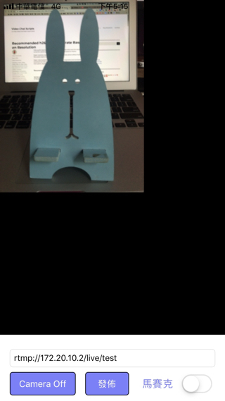
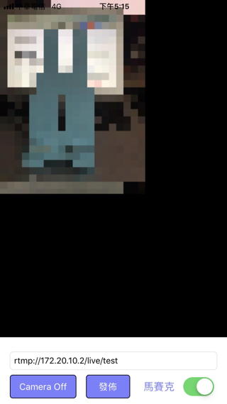
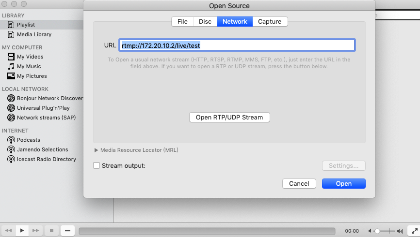

## MyLiveStreamer
直播練習，從相機取得畫面後，做特效處理，然後發佈至 streaming server

library version:

* ffmpeg : 3.1
* fdk-aac : 1.6
* x264 : stable branch
* libyuv

#### 一般




#### 開啟特效




## Streaming Server

1. 安裝 [Docker on mac](https://docs.docker.com/docker-for-mac/)
2. 去 DockerHub 找別人已設定好的 [nginx-rtmp image](https://hub.docker.com/r/tiangolo/nginx-rtmp)，我是用 tiangolo/nginx-rtmp
3. 啟動 docker container ```docker run -d -p 1935:1935 --name nginx-rtmp tiangolo/nginx-rtmp```
4. 查看你主機的 ip，改掉專案的網址 rtmp://{your_ip}/live/test，替換成你的 ip，按下「發佈」

測試接收，可先用 VLC 測試，Open Media > Network > URL，填入 rtmp://{your_ip}/live/test 即可



